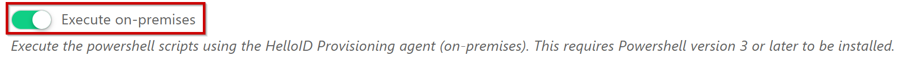
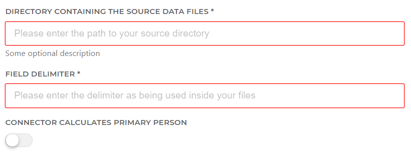

# HelloID-Conn-Prov-Source-RAET-HR-CORE-Education-CSV

| :information_source: Information |
|:---------------------------|
| This repository contains the connector and configuration code only. The implementer is responsible to acquire the connection details such as username, password, certificate, etc. You might even need to sign a contract or agreement with the supplier before implementing this connector. Please contact the client's application manager to coordinate the connector requirements.       |
 

  

## This is a work in progress

The _'HelloID-Conn-Prov-Source-RAET-HR-CORE-Education-CSV'_ connector needs to be executed 'on-premises'. Make sure you have a local 'HelloID provisioning agent' running, and the 'Execute on-premises' switch is toggled on.

## Table of contents

- [HelloID-Conn-Prov-Source-RAET-HR-CORE-Education-CSV](#helloid-conn-prov-source-raet-hr-core-education-csv)
  - [This is a work in progress](#this-is-a-work-in-progress)
  - [Table of contents](#table-of-contents)
  - [Introduction](#introduction)
  - [Prerequisites](#prerequisites)
  - [Mappings](#mappings)
  - [Setup the PowerShell source connector](#setup-the-powershell-source-connector)
  - [HelloID Docs](#helloid-docs)

## Introduction

This connector can be used as an example to import HR Core Education CSV files. Make sure to check the format of the CSV files. 

## Prerequisites

- A local running version of the 'HelloID provisioning agent'.

- A local directory on the server running the 'HelloID provisioning agent' containing the CSV files from RAET from the 'CSV source data' folder. The following CSV files are required: 
  - Medewerker.csv
  - Echtgenoot.csv
  - Telefoon.csv
  - Aanstellingen.csv
  - Functie.csv
  - Eenheid.csv
  - Manageridentificatie.csv

- The 'Execute on-premises' switch on the 'System' tab is toggled.

## Mappings

A basic person and contract mapping is provided. Make sure to further customize these accordingly.

## Setup the PowerShell source connector

1. Make sure your service account running the 'HelloID provisioning agent' service can access the local directory containing the Raet CSV files.

2. Add a new 'Source System' to HelloID and make sure to import all the necessary files.

    - [ ] configuration.json
    - [ ] personMapping.json
    - [ ] contractMapping.json
    - [ ] persons.ps1
    - [ ] departments.ps1

3. Fill in the required fields on the connectors 'Configuration' tab.

## HelloID Docs
The official HelloID documentation can be found at: https://docs.helloid.com/
